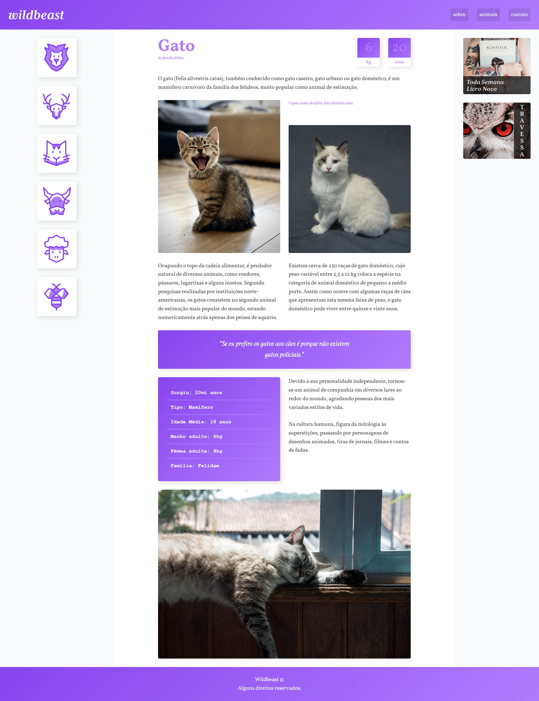

# Wildbeast

> Exemplo de blog de animais construído utilizando CSS Grid.

### Ajustes e melhorias

Projeto concluído!

- [x] Desenvolvimento utilizando majoritariamente CSS Grid
- [x] Páginas responsivas
- [x] Implementações básicas de JavaScript

## 💻 Pré-requisitos

Antes de começar, verifique se você atendeu aos seguintes requisitos:

* Você instalou a versão mais recente de `Node.js`.

## 🚀 Instalando Wildbeast

Para instalar o Wildbeast, siga estas etapas:

* Clone esse repositório com `git clone https://github.com/gguilhermelopes/wildbeast`
* Utilze uma extensão como a Live Server do VSCode em sua IDE para melhor visualização do site localmente

## ☕ Usando Wildbeast

Para usar Wildbeast, siga estas etapas:

* Abra o seu Live Server!
